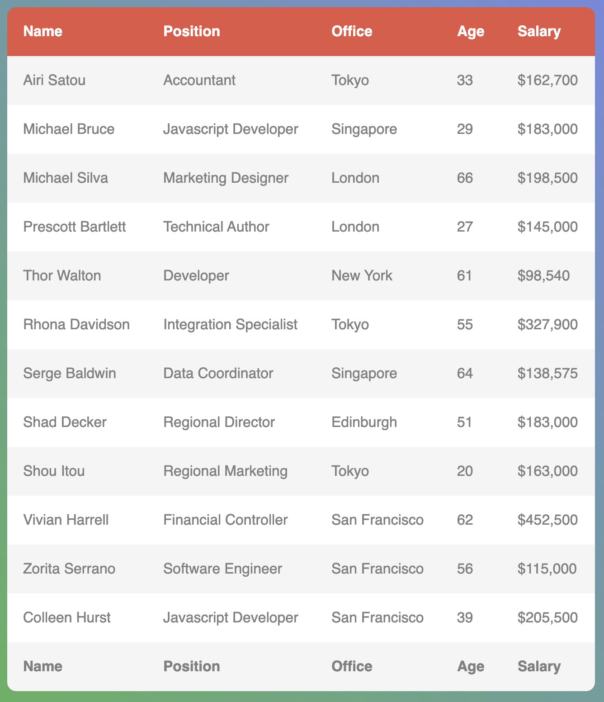
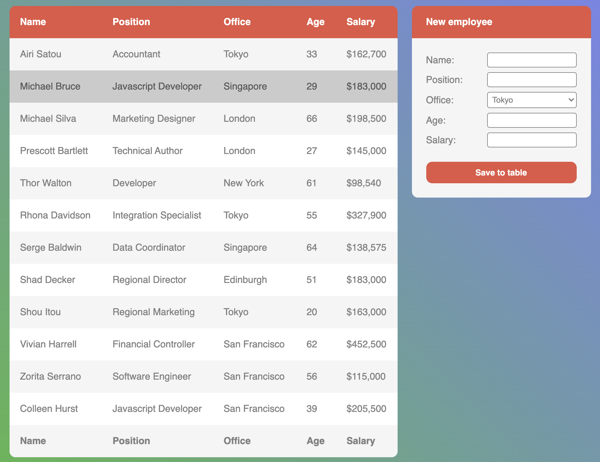

1. Replace `<your_account>` with your Github username in the link
    - [DEMO LINK](https://<your_account>.github.io/layout_stop-watch/)
2. Follow [this instructions](https://mate-academy.github.io/layout_task-guideline/)
    - There are no tests for this task so use `npm run lint` command instead of `npm test` 

### Task: Employees table

Hi, dear mate!
This is the final task of JS Advanced course. Apply all the acquired skills and show what you are capable of!

Let's get started. This task consists of what you already know.
Briefly about your tasks:
1. Implement table sorting by clicking on the title (this time in two directions).
2. When you click on a row of the table, it should become selected.
3. Use a script to add a form to the document that will allow you to add new employees to the spreadsheet.
4. Throw notification from previous tasks if form data is invalid.
5. Implement editing of table cells by double-clicking on it.

As always, all the necessary styles have already been written for you, you do not need to change the layout or styles in this task.

Let's move on to the requirements.

Start table:


##### Implement table sorting by clicking on the title (this time in two directions)
- Clicking on one of the table headers should sort the table first in ASC order, the second click sorts in DESC order.
- If you click on a new title, start sorting in ASC order always.

##### When you click on a row of the table, it should become selected.
- Use 'active' class for table row if it was clicked.
- Only one line can be selected at a time.

##### Use a script to add a form to the document that will allow you to add new employees to the spreadsheet.
- The form should have class `new-employee-form` for correct styles.
- The form should have 4 inputs, 1 select and submit button.
- Cover your inputs on labels like there:
```html
<label>Name: <input name="name" type="text"></label>
```
- Select should have 6 options: `Tokyo`, `Singapore`, `London`, `New York`, `Edinburgh`, `San Francisco`.
- Use texts for labels and buttons from the resulting screenshot.
- Age and salary inputs should have a number type. Don't forget to convert the string from salary input to correct value like in the table.
- Click on `Save to table` should add a new employee to the table.
- All fields are required.

##### Throw notification if form data is invalid.
- From now, click on `Save to table` should first run validation for form inputs and if the problem does not exists add a new employee to the table.
- If `Name` value has less than 4 letters, throw error notification about it.
- If `Age` value is less than 18 or bigger than 90 throw error notification about it.
- If a new employee successfully added to the table throw success notification about it.
- Title and description don't matter, it's up to you.
- You can use notifications from the previous task.

##### Implement editing of table cells by double-clicking on it (Optional)   
- Double click on the cell of the table, should remove text, and append input with `cell-input` class.
- The input value should contain replaced by input text.
- Only one cell can be edited at the time.
- On blur save changes to table cell. Remove input and set new text.
- On 'Enter' press save changes to the table cell. Remove input and set new text.
- If an input is empty on submitting return initial value.

It's an expected result of your job:


Good luck. We believe in you!
